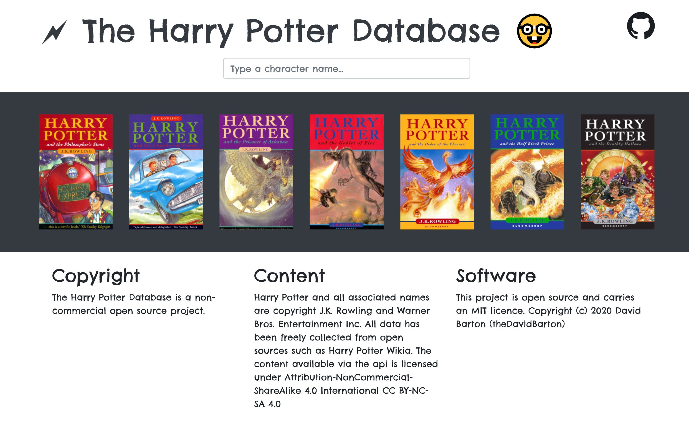

# python-harry-potter-database-backend


A **Python** implementation of [The Harry Potter Database](https://github.com/theDavidBarton/the-harry-potter-database) backend. :tada:    
🗲 A REST api to feed database about Harry Potter books.

7 books, 756 characters, 150 potions and 305 spells.



# API docs

`GET` **categories**

- /api/1/
- /api/1/categories
- /api/1/categories/{id}

`GET` **books**

- /api/1/books (mandatory parameter: **?search**)
- /api/1/books/all
- /api/1/books/{id}

`GET` **characters**

- /api/1/characters (mandatory parameter: **?search**)
- /api/1/characters/all
- /api/1/characters/{id}

`GET` **spells**

- /api/1/spells (mandatory parameter: **?search**)
- /api/1/spells/all
- /api/1/spells/{id}

`GET` **potions**

- /api/1/potions (mandatory parameter: **?search**)
- /api/1/potions/all
- /api/1/potions/{id}

_(availability)_   
`GET` **health**  

- /health (optional parameter: **`?from=`**)

# Local run

After `python server.py` the server will run on http://localhost:5000.

# Docker

```bash
docker build -t thedavidbarton/harry-potter .
docker run -p 1000:5000 -d thedavidbarton/harry-potter
```

Then you can access the api on http://localhost:1000/

# Copyright

The Harry Potter Database is a non-commercial open source project.

## Content

Harry Potter and all associated names are copyright J.K. Rowling and Warner Bros. Entertainment Inc.

All data has been freely collected from open sources such as [Harry Potter Wikia](https://harrypotter.fandom.com/wiki/Main_Page).

The content available via the api is licensed under _Attribution-NonCommercial-ShareAlike 4.0 International_ [CC BY-NC-SA 4.0](https://creativecommons.org/licenses/by-nc-sa/4.0/legalcode)

## Software

This project is open source and carries an [MIT licence](LICENSE).

Copyright (c) 2020, 2022, 2023 David Barton (theDavidBarton)

